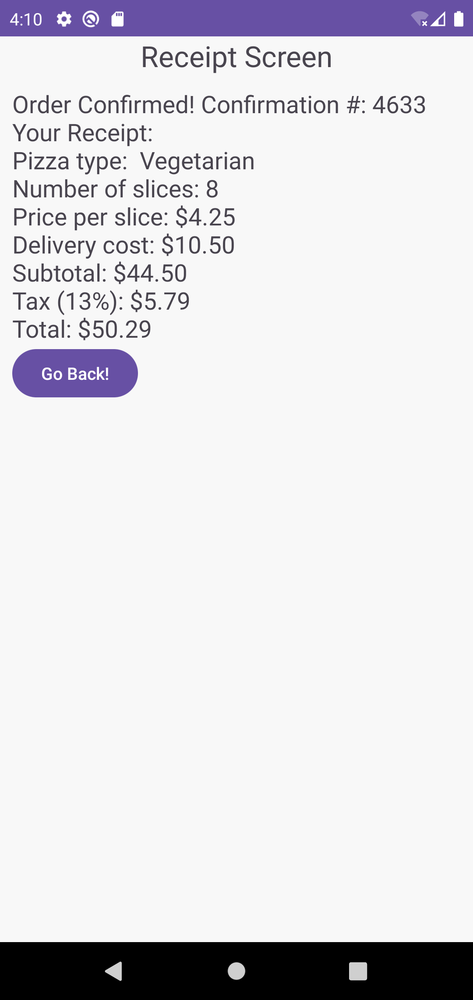

# Pizza Order App

<table>
  <tr>
    <td></td>
    <td></td>
  </tr>
</table>

## Descripción

Esta aplicación de Android, desarrollada con XML y Kotlin, simula un pedido en un restaurante de pizzas y calcula el precio final basado en las opciones seleccionadas. Los usuarios pueden elegir el tipo de pizza, el número de rebanadas, si desean una pizza entera y si necesitan entrega a domicilio. La aplicación proporciona un resumen del pedido, incluyendo el subtotal, los impuestos, el costo de entrega y el precio total. Este proyecto muestra prácticas modernas de desarrollo de Android, incluyendo Data Binding y Programación Orientada a Objetos.

## Características

- **Kotlin**: Utilizado para desarrollar la lógica de la aplicación.
- **XML**: Utilizado para diseñar la interfaz de usuario.
- **Intent**: Para navegar entre los diferentes componentes de la aplicación.
- **Binding**: Para un acceso eficiente y seguro a los componentes de la interfaz de usuario.
- **Serializable**: Para pasar estructuras de datos complejas entre actividades.
- **OOP**: Demuestra los principios de programación orientada a objetos.

## Configuración Necesaria

- No se requiere configuración adicional.

## Demostración

A continuación, algunas capturas de pantalla de la aplicación:

<table>
  <tr>
    <td></td>
    <td></td>
  </tr>
</table>

## License 

The MIT License (MIT)

- **Copyright (c) 2024 Jonathan Reátegui**

Permission is hereby granted, free of charge, to any person obtaining a copy of this software and associated documentation files (the "Software"), to deal in the Software without restriction, including without limitation the rights to use, copy, modify, merge, publish, distribute, sublicense, and/or sell copies of the Software, and to permit persons to whom the Software is furnished to do so, subject to the following conditions:

The above copyright notice and this permission notice shall be included in all copies or substantial portions of the Software.

THE SOFTWARE IS PROVIDED "AS IS", WITHOUT WARRANTY OF ANY KIND, EXPRESS OR IMPLIED, INCLUDING BUT NOT LIMITED TO THE WARRANTIES OF MERCHANTABILITY, FITNESS FOR A PARTICULAR PURPOSE AND NONINFRINGEMENT. IN NO EVENT SHALL THE AUTHORS OR COPYRIGHT HOLDERS BE LIABLE FOR ANY CLAIM, DAMAGES OR OTHER LIABILITY, WHETHER IN AN ACTION OF CONTRACT, TORT OR OTHERWISE, ARISING FROM, OUT OF OR IN CONNECTION WITH THE SOFTWARE OR THE USE OR OTHER DEALINGS IN THE SOFTWARE.
